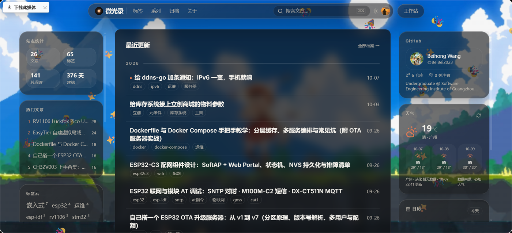

# 我的博客

Demo: https://www.beihong.wang

> 一个「纯文件 + 一台服务器」的个人技术博客 + 私人工作站。

内容以 Markdown 文件为唯一数据源：**没有数据库、没有多余服务，一个常驻进程跑起来**。本地写 `.md`、`git push` 即发布，也可以在网页后台 `/admin` 里分屏编辑。

## 预览



> 首页：左侧站点统计 / 热门文章 / 标签云，中间文章流，右侧 GitHub、天气、日历挂件（挂件可在设置里自由增减）。

## 特性

- **纯文件驱动**：`content/` 就是全部内容，diff 清晰、备份 = 复制文件夹
- **本地优先**：VS Code 写文章，`git push` 自动部署；`/admin` 提供网页编辑器（支持粘贴上传图片）
- **可见性三态**：`public` 公开 / `login` 仅登录可见 / `draft` 草稿（默认，安全兜底）
- **全文搜索**：中文分词 + minisearch，`⌘K` 命令面板
- **订阅与 SEO**：RSS 全文、sitemap、robots、OG 分享图（satori 生成）
- **评论区**：giscus（GitHub Discussions），不填就自动隐藏
- **侧栏挂件**：站点统计、日历、热门文章、标签云、一言、GitHub 卡片等，注册表加一行即扩展
- **私人工作站 `/w`**（登录后可见，全部可选）：服务器状态与机器体检、阅读统计、素材台、元器件库存、ESP32 OTA 升级、内嵌 MQTT broker、备份浏览、片段备忘、项目文档
- **热更新**：`content/` 文件一变自动重建索引，不用重启也不用重新构建
- **部署**：Docker Compose 一条命令；`git push` → 服务器钩子自动决定是否重建

## 技术栈

Next.js 16（App Router）· React 19 · TypeScript · Tailwind CSS v4 · shadcn/ui（Radix）· unified + shiki · minisearch + cmdk · chokidar · lowdb（JSON 文件）· pnpm

## 快速开始

```bash
pnpm install
cp .env.example .env.local     # 至少填 ADMIN_USERNAME / ADMIN_PASSWORD / AUTH_SECRET
pnpm dev                       # http://localhost:3000
```

- 后台：`http://localhost:3000/login` → 用 `.env.local` 里的账号登录
- 文章：往 `content/posts/` 丢 `.md`（frontmatter 见部署指南）
- 国内装依赖慢：`pnpm install --registry=https://registry.npmmirror.com`

## 目录结构

```
app/            页面与路由（公开站、/admin 后台、/w 工作站、RSS/sitemap/OG）
components/     UI 组件（含 components/ui 的 shadcn 源码）
lib/            内容解析、搜索、认证、MQTT、库存、备份状态等
content/posts/  文章（Markdown，唯一数据源）
content/pages/  单页：关于 / 免责声明 / 隐私政策 / 开源说明
content/images/ 图片（默认不进 git，见部署指南的图片方案）
data/           运行时数据（阅读量、站点设置、体检记录…… 不进 git）
deploy/         部署脚本：post-receive 钩子、Caddy 样例、备份与体检 systemd 单元
文档/           文档（容器只读挂载，供工作站 /w/docs 浏览）
```

## 常用命令

| 命令 | 说明 |
| --- | --- |
| `pnpm dev` | 本地开发 |
| `pnpm build` / `pnpm start` | 生产构建 / 启动（standalone） |
| `pnpm lint` | ESLint |
| `pnpm check:content` | 内容体检：文章数、可见性分布、年份/标签统计 |
| `pnpm check:site -- --site=https://example.com` | 线上站点体检：逐页取状态码 |
| `pnpm imgtool` | 本地素材台：图片上传到服务器、alt 文本、回收站 |

## 部署

完整步骤（Docker / 非 Docker / 反向代理 / `git push` 自动部署 / 备份 / 常见问题）见
**[文档/DEPLOY.md](文档/DEPLOY.md)**，最短路径是：

```bash
cp .env.example .env && $EDITOR .env
docker compose up -d --build      # 默认只监听 127.0.0.1:3000，由反向代理转发
```

## 许可

MIT，见 [LICENSE](LICENSE)。第三方开源组件与字体的出处、许可见
[content/pages/opensource.md](content/pages/opensource.md) 与 [public/fonts/README.md](public/fonts/README.md)。
